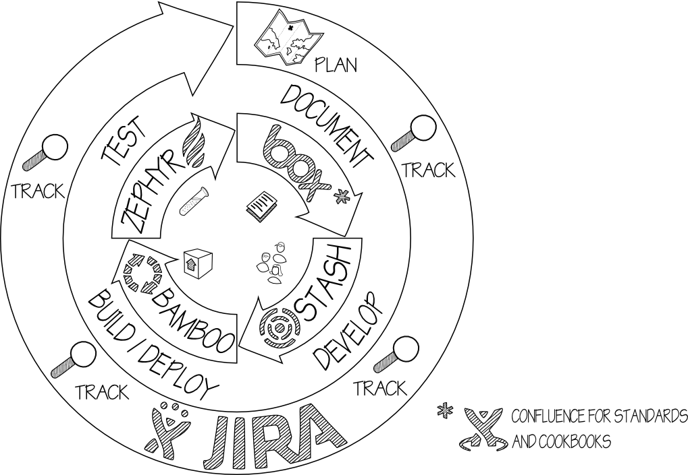

## about

* *what* is ALM?
* *why* should I care?
* *how* do I do it?
* *who* is it for?

## meet our characters
* Patty, the PM
	
	*wants to keep her project on track, on scope, on budget*

* Derek, the Developer

	*wants to develop, with as few interruptions as possible*

* Trevor, the Tester

	*wants to make sure everything is working fine*

* Barbara, the BA

	*wants to make sure her dear requirements get implemented*

* Suzie, the stakeholder

	*wants to make sure her money is being well spent - on-time and ASAP*

# Enter ALM

---

## current state

* Manual process
  - Labor intensive
  - Ad-hoc and misaligned
  - Fail-prone and vulnerable

* Lots of red tape, difficulty in procuring access/tools

---

## goals
* automation
  -  builds, tests, metrics, deployments
* streamlined process/tools
  - easy setup, easy reviews
* easy to reproduce prod-like environments
  - ~~works on my machine~~

---

## the tools

# DEMO

---

## Barbara

"I need to add requirements to a project"

"What requirements are being implemented right now?"

"What has already been delivered?"

---

## Derek
"How do I report progress?"

"How do I share my code?"

"Build broke. How do I fix it?"

---

## Patty

"Who's doing what?"

"Are we late or are we early?"

"How much road we have ahead of us?"

"Any blocks?"

---

## Trevor

"How do I plan my tests?"

"How do I track test execution?"

"How are bugs prioritized?"

"How do I make sure all critical scope has been tested?"

---

## All team members

"Eeek, there's an ARB coming!"

Q&A
===

1. How does this all fit with EPM?
2. Why Atlassian?
3. Can I use that for SAP and other ERPs?
4. How do I get access to all those goodies?